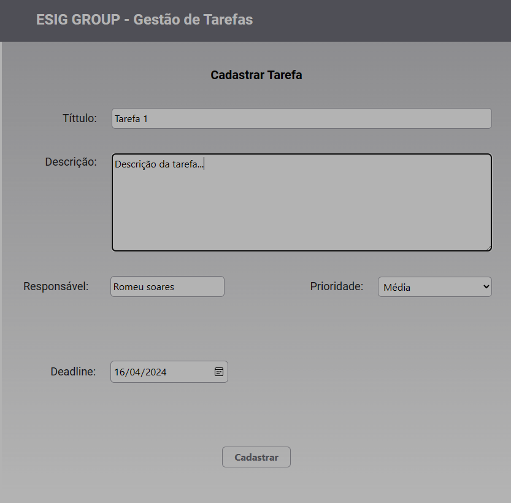
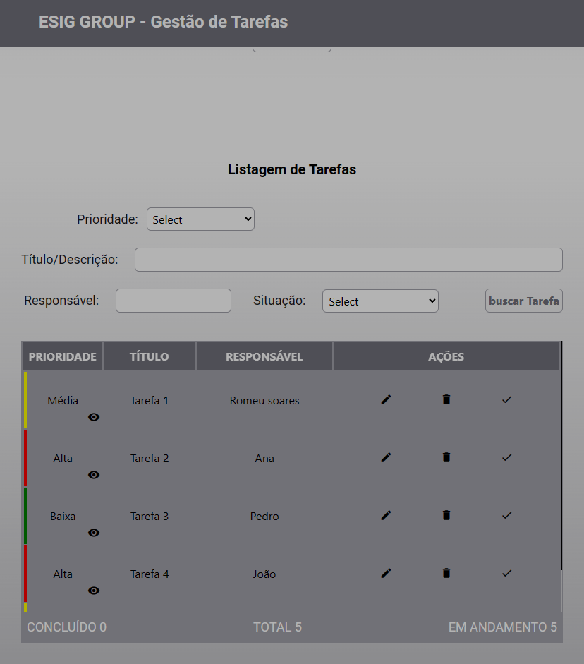
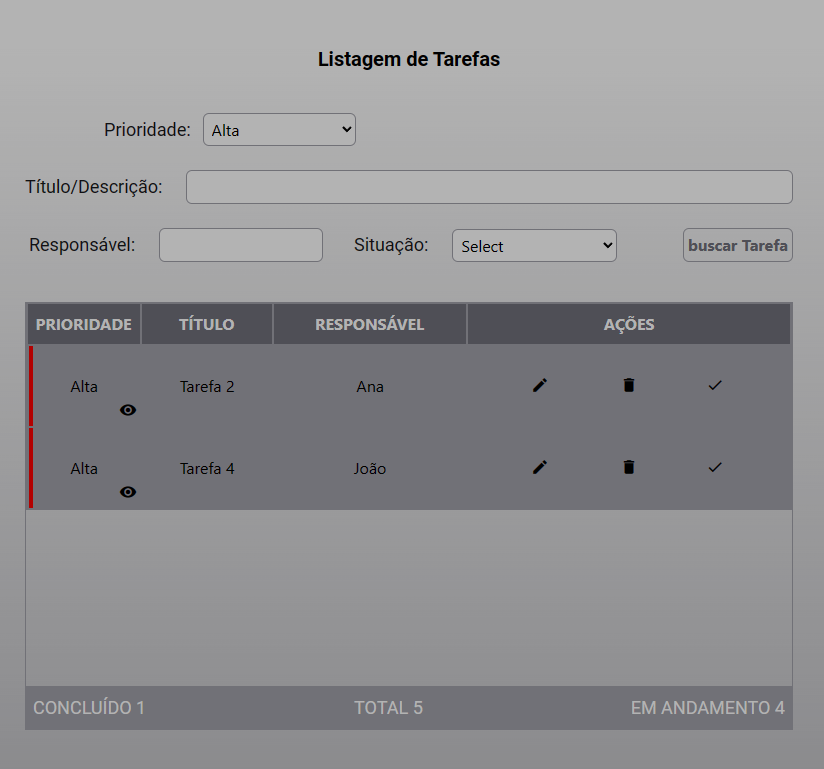
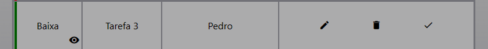
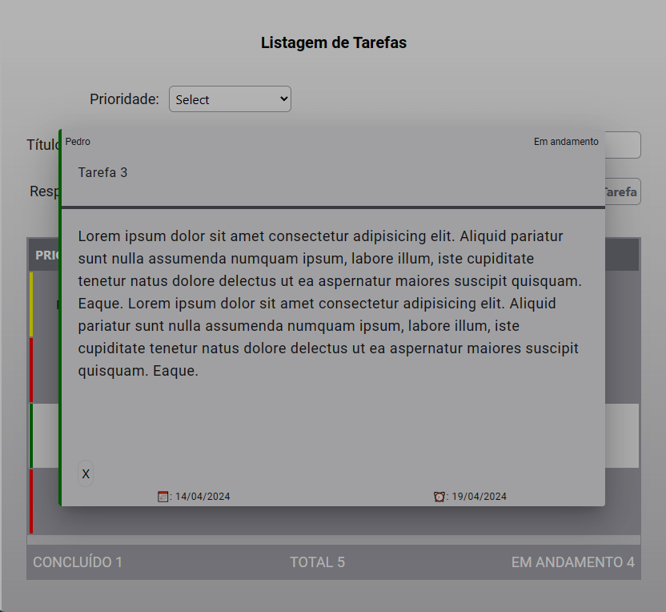

<h1 align='center'> API de Gerênciamento de Tarefas </h1>

A aplicação consiste em criar um simples gerenciador de tarefas
com as seguintes funcionalidades:

- Criar uma tarefa
- Atualizar a tarefa
- Remover a tarefa
- Listar tarefas
- Visualizar detalhes da tarefa

 Esta aplicação foi desenvolvida utilizando as seguintes tecnologias: 

- Angula
- Tailwindcss
- Typescriipt

 

Na figura a seguir representa o fomulário para cadastro de uma tarefa.

Tabela das tarefas que não foram concluídas.

Para visualização de tarefas específicas como por exemplo, tarefas já concluídas, pode-se fazer a filtragem no campo "situação" e clicar no botão "buscar tarefa".

Ao fazer uma filtragem como por exemplo pela prioridade "Alta", terá as tarefas que tem a prioridade definida como "Alta"

Segue ao lado um indentificador mais visual sobre a prioridade da tarefa, sendo ela, de cor vermelho indica "ALta", de cor amarelo indica "Média" e de cor verde indica "Baixa" prioridade.

Cada tarefa também conta com alguma funcionalidades como, visualizar detalhes da tarefa sinalizado por um icone de um olho

Pode também Editar, remover ou concluir uma tarefa, representados por icones.

Clicando em detalhes (icone do olho) de alguma tarefa podemos visualizar com mais detalhes essa tarefa.

